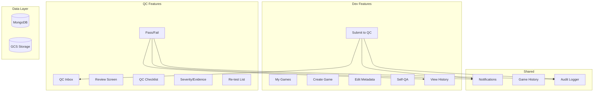

# Design Document: Dev & QC Workflow

## Overview

Hệ thống Dev & QC Workflow mở rộng Game Hub Manager với các tính năng:
- Dev: Quản lý game, Self-QA checklist, Submit to QC, View feedback
- QC: Inbox, Review với checklist chuẩn hóa, Pass/Fail decision, Severity & Evidence
- Shared: Notifications, Game history timeline

Hệ thống tích hợp với RBAC/ABAC hiện có, audit logging, và MongoDB.

## Architecture



## Components and Interfaces

### 1. Extended Game Model (`src/models/Game.ts`)

```typescript
export interface Game {
  _id: ObjectId;
  gameId: string;
  title: string;
  description?: string;
  ownerId: string;
  teamId?: string;
  status: GameStatus;
  
  // Metadata
  subject?: string;      // Môn học
  grade?: string;        // Lớp
  unit?: string;         // Unit SGK
  gameType?: string;     // Loại game
  priority?: 'low' | 'medium' | 'high';
  
  // Self-QA
  selfQaChecklist?: SelfQaItem[];
  selfQaNote?: string;
  
  // Timestamps
  submittedAt?: Date;
  createdAt: Date;
  updatedAt: Date;
  isDeleted: boolean;
}

export interface SelfQaItem {
  id: string;
  label: string;
  checked: boolean;
  checkedAt?: Date;
}
```

### 2. QC Report Model (`src/models/QcReport.ts`)

```typescript
export type QcResult = 'pass' | 'fail';
export type QcItemStatus = 'ok' | 'warning' | 'fail';
export type Severity = 'minor' | 'major' | 'critical';

export interface QcChecklistItem {
  category: string;
  status: QcItemStatus;
  note?: string;
}

export interface QcReport {
  _id: ObjectId;
  gameId: string;
  reviewerId: string;
  result: QcResult;
  checklist: QcChecklistItem[];
  note?: string;
  severity?: Severity;
  evidenceUrls?: string[];
  attemptNumber: number;
  createdAt: Date;
}
```

### 3. Notification Model (`src/models/Notification.ts`)

```typescript
export type NotificationType = 
  | 'game_submitted'
  | 'qc_passed'
  | 'qc_failed'
  | 'game_approved'
  | 'game_published';

export interface Notification {
  _id: ObjectId;
  userId: string;
  type: NotificationType;
  title: string;
  message: string;
  gameId?: string;
  isRead: boolean;
  createdAt: Date;
}
```

### 4. Game History Model (`src/models/GameHistory.ts`)

```typescript
export interface GameHistoryEntry {
  _id: ObjectId;
  gameId: string;
  action: string;
  actorId: string;
  actorEmail: string;
  oldStatus?: GameStatus;
  newStatus?: GameStatus;
  metadata?: Record<string, unknown>;
  createdAt: Date;
}
```

## Data Models

### MongoDB Collections

1. **games** - Extended with metadata, selfQaChecklist
2. **qc_reports** - QC review results with checklist
3. **notifications** - User notifications
4. **game_history** - Timeline of game changes

### Indexes

```javascript
// games
{ ownerId: 1 }
{ status: 1 }
{ subject: 1, grade: 1 }

// qc_reports
{ gameId: 1 }
{ reviewerId: 1 }
{ createdAt: -1 }

// notifications
{ userId: 1, isRead: 1 }
{ createdAt: -1 }

// game_history
{ gameId: 1, createdAt: -1 }
```

## Correctness Properties

*A property is a characteristic or behavior that should hold true across all valid executions of a system-essentially, a formal statement about what the system should do. Properties serve as the bridge between human-readable specifications and machine-verifiable correctness guarantees.*

### Property 1: Owner-based Game Filtering
*For any* user accessing My Games, all returned games SHALL have ownerId equal to the user's ID.
**Validates: Requirements 1.1**

### Property 2: Game Creation Defaults
*For any* newly created game, the status SHALL be 'draft' and ownerId SHALL equal the creating user's ID.
**Validates: Requirements 2.2**

### Property 3: Status-based Edit Restriction
*For any* game in 'approved' or 'published' status, edit operations SHALL be rejected with appropriate error.
**Validates: Requirements 3.3**

### Property 4: Submit Status Transition
*For any* successful submit operation, the game status SHALL change from 'draft' or 'qc_failed' to 'uploaded'.
**Validates: Requirements 5.2**

### Property 5: QC Inbox Status Filter
*For any* QC inbox query, all returned games SHALL have status equal to 'uploaded'.
**Validates: Requirements 7.1**

### Property 6: QC Pass Status Transition
*For any* QC pass operation, the game status SHALL change from 'uploaded' to 'qc_passed'.
**Validates: Requirements 10.3**

### Property 7: QC Fail Status Transition
*For any* QC fail operation, the game status SHALL change from 'uploaded' to 'qc_failed'.
**Validates: Requirements 10.4**

### Property 8: QC Fail Requires Note
*For any* QC fail submission without a note, the operation SHALL be rejected.
**Validates: Requirements 10.2**

### Property 9: Notification Creation on Status Change
*For any* game status change, a notification SHALL be created for the game owner.
**Validates: Requirements 13.1**

### Property 10: Permission Enforcement
*For any* user without required permission accessing a protected resource, the system SHALL return 403.
**Validates: Requirements 1.4, 7.4, 8.4**

## Error Handling

| Error Scenario | Handling Strategy |
|----------------|-------------------|
| Missing required fields | Return 400 with field-specific errors |
| Unauthorized access | Return 403 with permission error |
| Invalid status transition | Return 400 with explanation |
| Game not found | Return 404 |
| Database error | Log error, return 500 |

## Testing Strategy

### Property-Based Testing Library
- **Library**: fast-check (TypeScript/JavaScript)
- **Minimum iterations**: 100 per property test

### Unit Tests
- Game CRUD operations
- QC report creation and retrieval
- Notification creation
- Permission checks

### Property-Based Tests
Each correctness property will be implemented as a property-based test with annotation:
```typescript
// **Feature: dev-qc-workflow, Property {N}: {property_text}**
// **Validates: Requirements X.Y**
```
