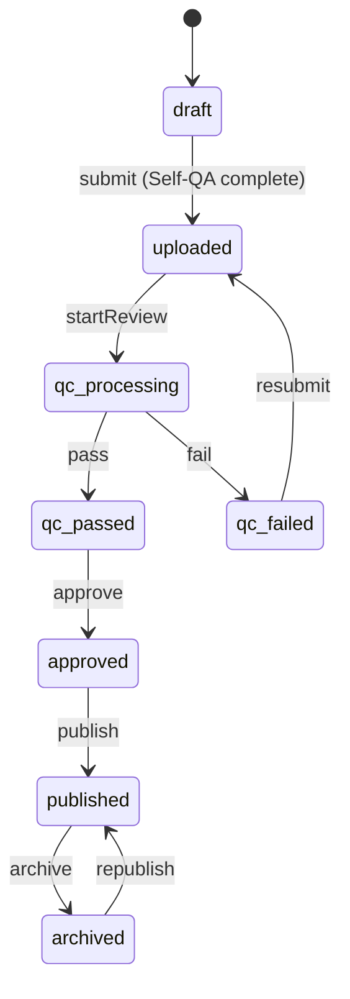

# Design Document: Draft/Publish Delivery System

## Overview

Hệ thống Draft/Publish Delivery tạo ra một lớp phân tách giữa Management Registry (MongoDB) và Public Registry (GCS JSON) để đảm bảo Game Hub chỉ nhận được các game đã được QC và approved. Hệ thống bao gồm:

1. **PublicRegistryManager**: Service quản lý Public Registry trên GCS
2. **Publishing Pipeline**: Quy trình đồng bộ từ MongoDB sang GCS khi publish
3. **Kill-switch & Rollout**: Cơ chế điều khiển visibility và gradual rollout
4. **Public API**: Endpoint cho Game Hub lấy danh sách game

## Architecture

```mermaid
flowchart TB
    subgraph CMS["Management System"]
        MongoDB[(MongoDB)]
        Admin[Admin Console]
        VSM[Version State Machine]
    end
    
    subgraph Delivery["Delivery Layer"]
        PRM[PublicRegistryManager]
        GCS[(GCS Storage)]
        PublicJSON[public.json]
    end
    
    subgraph Client["Game Hub"]
        API[/api/hub/games]
        Hub[Game Hub Client]
    end
    
    Admin -->|publish| VSM
    VSM -->|status: published| MongoDB
    VSM -->|trigger| PRM
    PRM -->|sync| PublicJSON
    PublicJSON -->|stored in| GCS
    
    Hub -->|fetch| API
    API -->|read| PublicJSON
    API -->|or query| MongoDB
```

## Components and Interfaces

### 1. PublicGameEntry Interface

```typescript
/**
 * Entry in the Public Registry - minimal data for Game Hub
 */
interface PublicGameEntry {
  id: string;              // Game ID (slug)
  title: string;
  entryUrl: string;        // URL to active version's index.html
  iconUrl?: string;        // Game icon
  runtime: string;         // "iframe-html"
  capabilities: string[];  // Required capabilities
  rolloutPercentage: number; // 0-100
  version: string;         // Active version string
  updatedAt: string;       // ISO timestamp
}
```

### 2. PublicRegistry Interface

```typescript
/**
 * The Public Registry structure stored on GCS
 */
interface PublicRegistry {
  games: PublicGameEntry[];
  generatedAt: string;     // ISO timestamp
  version: string;         // Registry schema version
}
```

### 3. PublicRegistryManager Service

```typescript
/**
 * Service for managing the Public Registry on GCS
 */
interface PublicRegistryManager {
  // Read the current public registry from GCS
  get(): Promise<PublicRegistry>;
  
  // Generate and upload public registry from MongoDB
  sync(): Promise<PublicRegistry>;
  
  // Add or update a single game entry
  upsertGame(entry: PublicGameEntry): Promise<void>;
  
  // Remove a game from public registry
  removeGame(gameId: string): Promise<void>;
  
  // Update rollout percentage for a game
  updateRollout(gameId: string, percentage: number): Promise<void>;
  
  // Get public registry filtered for a specific user (rollout logic)
  getForUser(userId: string): Promise<PublicGameEntry[]>;
}
```

### 4. Extended Game Model

```typescript
/**
 * Additional fields for Game model to support publishing
 */
interface GamePublishingFields {
  disabled: boolean;           // Kill-switch
  rolloutPercentage: number;   // 0-100, default 100
  publishedAt?: Date;          // When first published
  lastPublishedVersionId?: ObjectId; // Last published version
}
```

### 5. Publishing Service

```typescript
/**
 * Service orchestrating the publish workflow
 */
interface PublishingService {
  // Publish a version (approved -> published)
  publish(gameId: string, versionId: string, options: PublishOptions): Promise<PublishResult>;
  
  // Archive a published game
  archive(gameId: string): Promise<void>;
  
  // Toggle kill-switch
  setDisabled(gameId: string, disabled: boolean, reason: string): Promise<void>;
  
  // Set live version (for rollback)
  setLiveVersion(gameId: string, versionId: string): Promise<void>;
}

interface PublishOptions {
  setAsLive?: boolean;
  rolloutPercentage?: number;
}

interface PublishResult {
  success: boolean;
  version: GameVersion;
  publicEntry?: PublicGameEntry;
}
```

## Data Models

### PublicRegistry JSON Schema

```json
{
  "$schema": "http://json-schema.org/draft-07/schema#",
  "type": "object",
  "required": ["games", "generatedAt", "version"],
  "properties": {
    "games": {
      "type": "array",
      "items": {
        "type": "object",
        "required": ["id", "title", "entryUrl", "runtime", "version"],
        "properties": {
          "id": { "type": "string" },
          "title": { "type": "string" },
          "entryUrl": { "type": "string", "format": "uri" },
          "iconUrl": { "type": "string", "format": "uri" },
          "runtime": { "type": "string", "enum": ["iframe-html"] },
          "capabilities": { "type": "array", "items": { "type": "string" } },
          "rolloutPercentage": { "type": "integer", "minimum": 0, "maximum": 100 },
          "version": { "type": "string" },
          "updatedAt": { "type": "string", "format": "date-time" }
        }
      }
    },
    "generatedAt": { "type": "string", "format": "date-time" },
    "version": { "type": "string" }
  }
}
```

### Game Model Extensions (MongoDB)

```typescript
// Add to existing Game interface
interface Game {
  // ... existing fields ...
  
  // Publishing fields
  disabled: boolean;           // Default: false
  rolloutPercentage: number;   // Default: 100
  publishedAt?: Date;
}
```

### State Transitions




## Correctness Properties

*A property is a characteristic or behavior that should hold true across all valid executions of a system-essentially, a formal statement about what the system should do. Properties serve as the bridge between human-readable specifications and machine-verifiable correctness guarantees.*

### Property 1: Publish requires approved status
*For any* game version, the publish action SHALL succeed if and only if the version status is "approved". Attempting to publish a version with any other status SHALL result in rejection.
**Validates: Requirements 1.1, 1.5**

### Property 2: Publish updates status to published
*For any* approved game version, after a successful publish action, the version status in MongoDB SHALL be "published".
**Validates: Requirements 1.2**

### Property 3: Public Registry contains only published and enabled games
*For any* set of games in MongoDB, the Public Registry SHALL contain exactly those games where status is "published" AND disabled is false. No other games SHALL appear in the Public Registry.
**Validates: Requirements 2.1, 3.1, 3.3, 6.2, 6.3**

### Property 4: Public Registry serialization round-trip
*For any* valid PublicRegistry object, serializing to JSON and then parsing back SHALL produce an equivalent PublicRegistry object with all games and metadata preserved.
**Validates: Requirements 2.4, 2.5**

### Property 5: Public Registry entry contains required fields
*For any* game entry in the Public Registry, the entry SHALL contain all required fields: id, title, entryUrl, runtime, capabilities, rolloutPercentage, version, and updatedAt.
**Validates: Requirements 2.3, 6.4**

### Property 6: Disabled games excluded from Public Registry
*For any* game with disabled set to true, that game SHALL NOT appear in the Public Registry, regardless of its published status.
**Validates: Requirements 3.1, 3.2, 3.3**

### Property 7: Rollout percentage validation and persistence
*For any* rolloutPercentage value, the system SHALL accept only values between 0 and 100 inclusive. The accepted value SHALL be persisted in the Public Registry entry for that game.
**Validates: Requirements 4.1, 4.2, 4.4**

### Property 8: Live version requires published status
*For any* game version, setting it as the live version SHALL succeed if and only if the version status is "published".
**Validates: Requirements 5.2**

### Property 9: Live version updates entryUrl
*For any* game, when the live version is changed, the entryUrl in the Public Registry SHALL point to the new live version's index.html file.
**Validates: Requirements 5.1, 5.3**

### Property 10: Archive removes from Public Registry
*For any* published game, archiving it SHALL remove it from the Public Registry while preserving all data in MongoDB.
**Validates: Requirements 7.1, 7.2, 7.3**

### Property 11: Archive and republish round-trip
*For any* published game, archiving and then republishing SHALL restore the game to the Public Registry.
**Validates: Requirements 7.4**

### Property 12: State-changing actions are audited
*For any* state-changing action (publish, archive, disable, set live version), the system SHALL record an audit log entry with actor, timestamp, and relevant metadata.
**Validates: Requirements 3.4, 5.5, 7.5**

## Error Handling

### Publish Errors

| Error Condition | Response | HTTP Status |
|-----------------|----------|-------------|
| Version not found | `{ error: "Version not found" }` | 404 |
| Version not approved | `{ error: "Only approved versions can be published" }` | 400 |
| Missing index.html on GCS | `{ error: "Version files not found on storage" }` | 400 |
| Game already disabled | `{ error: "Cannot publish disabled game" }` | 400 |
| Insufficient permissions | `{ error: "Forbidden" }` | 403 |

### Registry Sync Errors

| Error Condition | Handling |
|-----------------|----------|
| GCS write failure | Retry up to 3 times, then log error and return failure |
| Invalid JSON parse | Return empty registry with error logged |
| Network timeout | Return cached version if available, log warning |

### Validation Errors

| Field | Validation | Error Message |
|-------|------------|---------------|
| rolloutPercentage | 0-100 integer | "Rollout percentage must be between 0 and 100" |
| versionId | Valid ObjectId | "Invalid version ID format" |
| gameId | Exists in DB | "Game not found" |

## Testing Strategy

### Property-Based Testing Library

The project will use **fast-check** for property-based testing in TypeScript/JavaScript.

### Test Configuration

- Minimum 100 iterations per property test
- Each property test must be tagged with: `**Feature: draft-publish-delivery, Property {number}: {property_text}**`

### Unit Tests

Unit tests will cover:
- PublicRegistryManager CRUD operations
- State machine transitions for publish/archive
- Rollout percentage validation
- API endpoint responses

### Property-Based Tests

Each correctness property will have a corresponding property-based test:

1. **Property 1 Test**: Generate random versions with various statuses, attempt publish, verify only approved versions succeed
2. **Property 3 Test**: Generate random game sets with mixed statuses/disabled flags, sync registry, verify filtering
3. **Property 4 Test**: Generate random PublicRegistry objects, serialize/deserialize, verify equality
4. **Property 7 Test**: Generate random rollout values, verify validation and persistence
5. **Property 10 Test**: Generate published games, archive, verify removal from registry and data preservation

### Integration Tests

- End-to-end publish workflow
- Registry sync with actual GCS (test bucket)
- API endpoint with authentication

### Test Data Generators

```typescript
// Generator for random game versions
const versionStatusGen = fc.constantFrom(
  'draft', 'uploaded', 'qc_processing', 'qc_passed', 
  'qc_failed', 'approved', 'published', 'archived'
);

// Generator for valid rollout percentages
const rolloutGen = fc.integer({ min: 0, max: 100 });

// Generator for PublicGameEntry
const publicGameEntryGen = fc.record({
  id: fc.string({ minLength: 1, maxLength: 50 }),
  title: fc.string({ minLength: 1, maxLength: 100 }),
  entryUrl: fc.webUrl(),
  runtime: fc.constant('iframe-html'),
  capabilities: fc.array(fc.string()),
  rolloutPercentage: rolloutGen,
  version: fc.stringMatching(/^\d+\.\d+\.\d+$/),
  updatedAt: fc.date().map(d => d.toISOString())
});
```

## File Structure

```
src/
├── lib/
│   ├── public-registry.ts      # PublicRegistryManager service
│   └── publishing-service.ts   # Publishing orchestration
├── pages/
│   └── api/
│       ├── hub/
│       │   └── games.ts        # Public API for Game Hub
│       └── games/
│           └── [id]/
│               ├── publish.ts  # (existing, update)
│               ├── archive.ts  # Archive endpoint
│               └── set-live.ts # (existing, update)
└── models/
    └── Game.ts                 # (update with disabled, rolloutPercentage)
```
