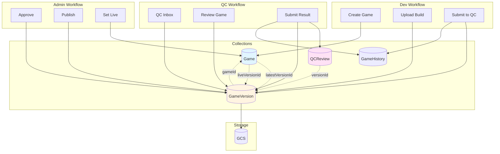

# Design Document: Game Versioning System

## Overview

The Game Versioning System transforms the Game Hub Manager's data architecture from a single-collection, single-status model to a multi-collection versioning system. This enables:

- **Parallel version management**: Dev can work on v1.2 while QC tests v1.1 and users play v1.0
- **Detailed QC history**: Each test session is recorded separately with full context
- **Traceability**: Track exactly which build had which issues
- **Re-test support**: QC can see previous failures and focus regression testing
- **No conflicts**: New uploads don't overwrite files being tested

The system introduces three core collections:
1. **Game** - Stable metadata (title, owner, tags)
2. **GameVersion** - Build-specific data (files, status, Self-QA)
3. **QCReview** - Individual test sessions with results

## Architecture



## Components and Interfaces

### 1. Game Model (`src/models/Game.ts`)

The Game model stores stable metadata that rarely changes.

```typescript
export interface Game {
  _id: ObjectId;
  slug: string;              // Unique identifier (e.g., "com.iruka.math-game")
  title: string;
  description?: string;
  ownerId: string;           // User._id
  teamId?: string;
  
  // Version references
  latestVersionId?: ObjectId; // Most recent GameVersion
  liveVersionId?: ObjectId;   // Currently published version for users
  
  // Display metadata
  subject?: string;           // Môn học
  grade?: string;             // Lớp
  tags?: string[];
  
  // Timestamps
  createdAt: Date;
  updatedAt: Date;
  isDeleted: boolean;
}

export class GameRepository {
  async create(input: CreateGameInput): Promise<Game>;
  async findBySlug(slug: string): Promise<Game | null>;
  async findByOwnerId(ownerId: string): Promise<Game[]>;
  async updateLatestVersion(gameId: string, versionId: ObjectId): Promise<void>;
  async updateLiveVersion(gameId: string, versionId: ObjectId): Promise<void>;
  async updateMetadata(gameId: string, data: Partial<Game>): Promise<Game | null>;
}
```

### 2. GameVersion Model (`src/models/GameVersion.ts`)

The GameVersion model represents a specific build with its own lifecycle.

```typescript
export type VersionStatus = 
  | 'draft'           // Dev is working on it
  | 'uploaded'        // Submitted to QC, waiting
  | 'qc_processing'   // QC is actively testing
  | 'qc_passed'       // QC approved
  | 'qc_failed'       // QC rejected
  | 'approved'        // CTO/Admin approved
  | 'published';      // Live for users

export interface SelfQAChecklist {
  testedDevices: boolean;
  testedAudio: boolean;
  gameplayComplete: boolean;
  contentVerified: boolean;
  note?: string;
}

export interface GameVersion {
  _id: ObjectId;
  gameId: ObjectId;          // Reference to Game
  version: string;           // SemVer (e.g., "1.0.1")
  
  // Storage
  storagePath: string;       // "games/{slug}/{version}/"
  entryFile: string;         // "index.html"
  buildSize?: number;        // Bytes
  
  // Status
  status: VersionStatus;
  
  // Self-QA
  selfQAChecklist?: SelfQAChecklist;
  releaseNote?: string;      // What changed in this version
  
  // Submission
  submittedBy: ObjectId;     // User._id
  submittedAt?: Date;
  
  // Timestamps
  createdAt: Date;
  updatedAt: Date;
}

export class GameVersionRepository {
  async create(input: CreateVersionInput): Promise<GameVersion>;
  async findById(id: string): Promise<GameVersion | null>;
  async findByGameId(gameId: string): Promise<GameVersion[]>;
  async findByVersion(gameId: string, version: string): Promise<GameVersion | null>;
  async findByStatus(status: VersionStatus): Promise<GameVersion[]>;
  async updateStatus(id: string, status: VersionStatus): Promise<GameVersion | null>;
  async updateSelfQA(id: string, checklist: SelfQAChecklist): Promise<GameVersion | null>;
  async getNextVersion(gameId: string): Promise<string>;
}
```

### 3. QCReview Model (`src/models/QCReview.ts`)

The QCReview model captures a single QC test session.

```typescript
export type QcResult = 'pass' | 'fail';
export type QcItemStatus = 'ok' | 'warning' | 'fail';
export type Severity = 'minor' | 'major' | 'critical';

export interface QcChecklistItem {
  category: string;          // 'ui', 'audio', 'performance', 'logic', 'content'
  status: QcItemStatus;
  note?: string;
}

export interface QCReview {
  _id: ObjectId;
  gameId: ObjectId;          // Reference to Game
  versionId: ObjectId;       // Reference to GameVersion
  reviewerId: ObjectId;      // User._id
  reviewerEmail: string;
  
  // Timing
  startedAt: Date;
  finishedAt: Date;
  
  // Results
  result: QcResult;
  severity?: Severity;       // Required if result is 'fail'
  checklist: QcChecklistItem[];
  note?: string;             // Overall feedback
  attachments?: string[];    // GCS URLs for screenshots/videos
  
  // Context
  attemptNumber: number;     // 1st test, 2nd test (re-test), etc.
  
  createdAt: Date;
}

export class QCReviewRepository {
  async create(input: CreateQCReviewInput): Promise<QCReview>;
  async findByVersionId(versionId: string): Promise<QCReview[]>;
  async findByGameId(gameId: string): Promise<QCReview[]>;
  async getLatestByVersionId(versionId: string): Promise<QCReview | null>;
  async countByGameId(gameId: string): Promise<number>;
}
```

### 4. State Machine Service (`src/lib/version-state-machine.ts`)

Enforces valid status transitions for GameVersion.

```typescript
export interface StateTransition {
  from: VersionStatus[];
  to: VersionStatus;
  requiredPermission?: string;
  validate?: (version: GameVersion) => Promise<boolean>;
}

export const STATE_TRANSITIONS: Record<string, StateTransition> = {
  submit: {
    from: ['draft', 'qc_failed'],
    to: 'uploaded',
    requiredPermission: 'games:submit',
    validate: async (version) => {
      // Check Self-QA completion
      return version.selfQAChecklist?.testedDevices === true;
    }
  },
  startReview: {
    from: ['uploaded'],
    to: 'qc_processing',
    requiredPermission: 'games:review'
  },
  pass: {
    from: ['qc_processing'],
    to: 'qc_passed',
    requiredPermission: 'games:review'
  },
  fail: {
    from: ['qc_processing'],
    to: 'qc_failed',
    requiredPermission: 'games:review'
  },
  approve: {
    from: ['qc_passed'],
    to: 'approved',
    requiredPermission: 'games:approve'
  },
  publish: {
    from: ['approved'],
    to: 'published',
    requiredPermission: 'games:publish'
  }
};

export class VersionStateMachine {
  async transition(
    versionId: string,
    action: string,
    userId: string
  ): Promise<GameVersion>;
  
  canTransition(
    currentStatus: VersionStatus,
    action: string
  ): boolean;
  
  getValidActions(currentStatus: VersionStatus): string[];
}
```

### 5. Migration Service (`src/lib/migration-service.ts`)

Migrates existing games to the new model.

```typescript
export interface MigrationResult {
  gamesProcessed: number;
  versionsCreated: number;
  errors: string[];
}

export class MigrationService {
  /**
   * Migrate all existing games to versioning model
   */
  async migrateAllGames(): Promise<MigrationResult>;
  
  /**
   * Migrate a single game
   */
  async migrateGame(oldGame: OldGame): Promise<{
    game: Game;
    version: GameVersion;
  }>;
}
```

## Data Models

### MongoDB Collections

#### 1. games
```javascript
{
  _id: ObjectId,
  slug: String (unique),
  title: String,
  description: String,
  ownerId: String,
  teamId: String,
  latestVersionId: ObjectId,
  liveVersionId: ObjectId,
  subject: String,
  grade: String,
  tags: [String],
  createdAt: Date,
  updatedAt: Date,
  isDeleted: Boolean
}
```

#### 2. game_versions
```javascript
{
  _id: ObjectId,
  gameId: ObjectId,
  version: String,
  storagePath: String,
  entryFile: String,
  buildSize: Number,
  status: String,
  selfQAChecklist: {
    testedDevices: Boolean,
    testedAudio: Boolean,
    gameplayComplete: Boolean,
    contentVerified: Boolean,
    note: String
  },
  releaseNote: String,
  submittedBy: ObjectId,
  submittedAt: Date,
  createdAt: Date,
  updatedAt: Date
}
```

#### 3. qc_reviews
```javascript
{
  _id: ObjectId,
  gameId: ObjectId,
  versionId: ObjectId,
  reviewerId: ObjectId,
  reviewerEmail: String,
  startedAt: Date,
  finishedAt: Date,
  result: String,
  severity: String,
  checklist: [{
    category: String,
    status: String,
    note: String
  }],
  note: String,
  attachments: [String],
  attemptNumber: Number,
  createdAt: Date
}
```

### Indexes

```javascript
// games
db.games.createIndex({ slug: 1 }, { unique: true });
db.games.createIndex({ ownerId: 1 });
db.games.createIndex({ isDeleted: 1 });

// game_versions
db.game_versions.createIndex({ gameId: 1 });
db.game_versions.createIndex({ gameId: 1, version: 1 }, { unique: true });
db.game_versions.createIndex({ status: 1 });
db.game_versions.createIndex({ submittedAt: -1 });

// qc_reviews
db.qc_reviews.createIndex({ gameId: 1 });
db.qc_reviews.createIndex({ versionId: 1 });
db.qc_reviews.createIndex({ reviewerId: 1 });
db.qc_reviews.createIndex({ createdAt: -1 });
db.qc_reviews.createIndex({ gameId: 1, attemptNumber: 1 });
```

## Correctness Properties

*A property is a characteristic or behavior that should hold true across all valid executions of a system-essentially, a formal statement about what the system should do. Properties serve as the bridge between human-readable specifications and machine-verifiable correctness guarantees.*


### Property Reflection

After analyzing all acceptance criteria, I identified the following redundancies:

- **5.1 is redundant with 2.3**: Both test that GameVersion defaults to 'draft' status
- **10.1 is redundant with 3.2**: Both test that checklist is saved in QCReview
- **10.2 is redundant with 3.5**: Both test that QC history returns checklist results

These redundant properties will be consolidated into single comprehensive properties.

### Property 1: Game Creation Completeness
*For any* valid game creation input, the created Game document SHALL contain slug, title, ownerId, and all provided metadata fields.
**Validates: Requirements 1.1**

### Property 2: Version Reference Integrity
*For any* game with multiple versions, the Game document SHALL maintain valid ObjectId references in latestVersionId and liveVersionId fields that point to existing GameVersion documents.
**Validates: Requirements 1.2**

### Property 3: Soft Delete Preservation
*For any* game that is deleted, the isDeleted field SHALL be true AND all associated GameVersion documents SHALL remain in the database.
**Validates: Requirements 1.4**

### Property 4: Slug Uniqueness
*For any* two game creation attempts with the same slug, the second attempt SHALL be rejected with an error.
**Validates: Requirements 1.5**

### Property 5: Version Auto-Increment
*For any* game with existing versions, uploading a new build SHALL create a GameVersion with a version number greater than all existing versions for that game.
**Validates: Requirements 2.1, 4.2**

### Property 6: GameVersion Required Fields
*For any* created GameVersion, the document SHALL contain storagePath, entryFile, submittedBy, and submittedAt fields with non-null values.
**Validates: Requirements 2.2**

### Property 7: GameVersion Default Status
*For any* GameVersion created without explicit status, the status field SHALL equal 'draft'.
**Validates: Requirements 2.3, 5.1**

### Property 8: Self-QA Persistence
*For any* GameVersion where Self-QA data is submitted, retrieving that GameVersion SHALL return the same selfQAChecklist data.
**Validates: Requirements 2.4**

### Property 9: Release Note Storage
*For any* GameVersion with release notes added, the releaseNote field SHALL contain the provided text.
**Validates: Requirements 2.5**

### Property 10: QCReview Version Linkage
*For any* completed QC review, the created QCReview document SHALL have a versionId that references an existing GameVersion document.
**Validates: Requirements 3.1**

### Property 11: QCReview Required Fields
*For any* created QCReview, the document SHALL contain reviewerId, startedAt, finishedAt, result, and checklist fields.
**Validates: Requirements 3.2, 10.1**

### Property 12: Fail Severity Requirement
*For any* QCReview with result 'fail' submitted without a severity field, the creation SHALL be rejected with an error.
**Validates: Requirements 3.3**

### Property 13: Evidence Attachment Storage
*For any* QCReview with uploaded evidence, the attachments field SHALL contain all provided URLs.
**Validates: Requirements 3.4**

### Property 14: QC History Ordering
*For any* game with multiple QCReview documents, querying QC history SHALL return reviews ordered by createdAt in descending order (newest first).
**Validates: Requirements 3.5, 10.2**

### Property 15: SemVer Validation
*For any* manually specified version string, the system SHALL accept it only if it matches the SemVer format (X.Y.Z where X, Y, Z are non-negative integers).
**Validates: Requirements 4.3**

### Property 16: Version Uniqueness
*For any* game, attempting to create two GameVersion documents with the same version string SHALL result in the second attempt being rejected.
**Validates: Requirements 4.4**

### Property 17: Version Query by String
*For any* GameVersion created with a specific version string, querying by that gameId and version string SHALL return that exact GameVersion.
**Validates: Requirements 4.5**

### Property 18: Submit State Transition
*For any* GameVersion with status 'draft' or 'qc_failed', transitioning to 'uploaded' SHALL succeed, and any other starting status SHALL be rejected.
**Validates: Requirements 5.2**

### Property 19: Start Review State Transition
*For any* GameVersion with status 'uploaded', transitioning to 'qc_processing' SHALL succeed, and any other starting status SHALL be rejected.
**Validates: Requirements 5.3**

### Property 20: Pass State Transition
*For any* GameVersion with status 'qc_processing', transitioning to 'qc_passed' SHALL succeed, and any other starting status SHALL be rejected.
**Validates: Requirements 5.4**

### Property 21: Fail State Transition
*For any* GameVersion with status 'qc_processing', transitioning to 'qc_failed' SHALL succeed, and any other starting status SHALL be rejected.
**Validates: Requirements 5.5**

### Property 22: Invalid Transition Rejection
*For any* invalid state transition attempt, the system SHALL reject it with an error message listing valid transitions from the current status.
**Validates: Requirements 5.6**

### Property 23: Re-test Detection
*For any* game with one or more QCReview documents, the re-test indicator SHALL be true, and for games with zero QCReview documents, it SHALL be false.
**Validates: Requirements 6.1**

### Property 24: Attempt Count Accuracy
*For any* game, the displayed attempt count SHALL equal the number of QCReview documents associated with that gameId.
**Validates: Requirements 6.2**

### Property 25: Previous Review Accessibility
*For any* game being re-tested, querying SHALL return all previous QCReview documents with their results and severity.
**Validates: Requirements 6.3**

### Property 26: Re-test Filter Correctness
*For any* QC inbox query with re-test filter enabled, all returned games SHALL have at least one QCReview document.
**Validates: Requirements 6.4**

### Property 27: Review Linkage Through IDs
*For any* new QCReview created for a game, it SHALL share the same gameId as previous QCReview documents for that game.
**Validates: Requirements 6.5**

### Property 28: Version History Ordering
*For any* game with multiple GameVersion documents, querying version history SHALL return versions ordered by version number in ascending or descending order.
**Validates: Requirements 7.1**

### Property 29: Version History Completeness
*For any* GameVersion in history, the returned data SHALL include version, status, submittedAt, and associated QC result if available.
**Validates: Requirements 7.2**

### Property 30: Version Detail Retrieval
*For any* specific GameVersion, querying SHALL return Self-QA data and all associated QCReview documents.
**Validates: Requirements 7.3**

### Property 31: Release Note Retrieval
*For any* GameVersion with a releaseNote, querying that version SHALL return the releaseNote field.
**Validates: Requirements 7.4**

### Property 32: Version Deletion Prevention
*For any* GameVersion, attempting to delete it SHALL be rejected or result in soft delete only, maintaining the document in the database.
**Validates: Requirements 7.5**

### Property 33: Live Version Status Requirement
*For any* attempt to set liveVersionId, the operation SHALL succeed only if the target GameVersion has status 'published'.
**Validates: Requirements 8.1**

### Property 34: Live Version Field Update
*For any* successful liveVersionId update, querying the Game document SHALL return the new liveVersionId value.
**Validates: Requirements 8.2**

### Property 35: Live Version Path Usage
*For any* game access request, the system SHALL construct file paths using the storagePath from the GameVersion referenced by liveVersionId.
**Validates: Requirements 8.3**

### Property 36: Live Version Auto-Update Prevention
*For any* GameVersion status change to 'published', the Game's liveVersionId SHALL remain unchanged unless explicitly updated.
**Validates: Requirements 8.5**

### Property 37: Storage Path Format
*For any* created GameVersion, the storagePath SHALL match the format "games/{slug}/{version}/" where slug and version come from the game and version data.
**Validates: Requirements 9.1**

### Property 38: Version-Specific File Storage
*For any* build file upload, files SHALL be stored at the path specified by the GameVersion's storagePath field.
**Validates: Requirements 9.2**

### Property 39: File URL Construction
*For any* game file serving request, the constructed URL SHALL include the storagePath from the relevant GameVersion.
**Validates: Requirements 9.4**

### Property 40: Storage Path Uniqueness
*For any* two GameVersion documents, their storagePath values SHALL be unique (no conflicts).
**Validates: Requirements 9.5**

### Property 41: Checklist Comparison
*For any* two QCReview documents for the same game, comparing their checklist fields SHALL identify which items changed status between reviews.
**Validates: Requirements 10.3**

### Property 42: Checklist Item Notes
*For any* QcChecklistItem with status 'fail' or 'warning', the item SHALL allow a note field to be stored and retrieved.
**Validates: Requirements 10.4**

### Property 43: Checklist Category Flexibility
*For any* QCReview, the checklist SHALL support items with category values from a configurable set (UI, Audio, Performance, Logic, Content, or custom categories).
**Validates: Requirements 10.5**

### Property 44: Migration Game Creation
*For any* existing game record processed by migration, a new Game document SHALL be created with data from the original record.
**Validates: Requirements 11.1**

### Property 45: Migration Version Creation
*For any* existing game record processed by migration, a new GameVersion document SHALL be created with version "1.0.0".
**Validates: Requirements 11.2**

### Property 46: Migration Status Preservation
*For any* existing game record with a status field, the migrated GameVersion SHALL have the same status value.
**Validates: Requirements 11.3**

### Property 47: Migration Reference Setting
*For any* migrated game, the Game document's latestVersionId SHALL reference the created GameVersion's _id.
**Validates: Requirements 11.4**

### Property 48: API Game Data Join
*For any* API query for game data, the response SHALL include data from both Game and GameVersion collections when both exist.
**Validates: Requirements 13.1**

### Property 49: API Version Information Inclusion
*For any* API response returning game data, the response SHALL include latestVersion and liveVersion information if those references exist.
**Validates: Requirements 13.2**

### Property 50: API Status Update Routing
*For any* API call to update game status, the status field of the appropriate GameVersion document SHALL be updated, not the Game document.
**Validates: Requirements 13.3**

### Property 51: API Atomic Game Creation
*For any* API call to create a game, both a Game document and an initial GameVersion document SHALL be created, or neither SHALL be created (atomic operation).
**Validates: Requirements 13.4**

## Error Handling

| Error Scenario | HTTP Status | Handling Strategy |
|----------------|-------------|-------------------|
| Duplicate slug | 409 Conflict | Return error with message "Game with this slug already exists" |
| Invalid version format | 400 Bad Request | Return error with SemVer format explanation |
| Duplicate version | 409 Conflict | Return error with message "Version X.Y.Z already exists" |
| Invalid state transition | 400 Bad Request | Return error listing valid transitions from current state |
| Missing severity on fail | 400 Bad Request | Return error "Severity required when result is 'fail'" |
| Version not found | 404 Not Found | Return error "GameVersion not found" |
| Game not found | 404 Not Found | Return error "Game not found" |
| No live version set | 404 Not Found | Return error "No published version available" |
| Unauthorized transition | 403 Forbidden | Return error "Insufficient permissions for this action" |
| Database connection error | 500 Internal Server Error | Log error, return generic message |
| GCS upload failure | 500 Internal Server Error | Log error, rollback version creation |

## Testing Strategy

### Property-Based Testing Library
- **Library**: fast-check (TypeScript/JavaScript)
- **Minimum iterations**: 100 per property test
- **Configuration**: Each test will use `fc.assert(fc.property(...), { numRuns: 100 })`

### Unit Tests
Unit tests will cover specific examples and integration points:
- Game creation with various metadata combinations
- Version number parsing and validation
- State machine transition logic
- Migration service for edge cases (empty games, games with existing versions)
- Storage path generation
- QC review creation with different checklist configurations

### Property-Based Tests
Each correctness property (1-51) will be implemented as a property-based test with the following annotation format:

```typescript
// **Feature: game-versioning-system, Property {N}: {property_text}**
// **Validates: Requirements X.Y**
test('Property N: {property_text}', async () => {
  await fc.assert(
    fc.asyncProperty(
      // Generators here
      async (...args) => {
        // Test implementation
      }
    ),
    { numRuns: 100 }
  );
});
```

### Test Generators
Custom generators will be created for:
- **GameInput**: Random valid game data (slug, title, owner, metadata)
- **VersionInput**: Random version data with valid SemVer
- **QCReviewInput**: Random review data with checklist
- **VersionStatus**: Random valid status values
- **StateTransition**: Random valid/invalid state transitions

### Integration Tests
- End-to-end workflow: Create game → Upload version → Submit to QC → Review → Approve → Publish
- Migration: Run migration on test database with sample old-format games
- API compatibility: Test existing API endpoints with new data model

### Performance Tests
- Query performance with 1000+ versions per game
- QC history retrieval with 100+ reviews
- Index effectiveness verification

## Implementation Notes

### Backward Compatibility
During transition period, the system will:
1. Support both old and new API formats
2. Automatically migrate games on first access if not yet migrated
3. Maintain old `status` field in Game for legacy code
4. Gradually deprecate old endpoints

### GCS Storage Structure
```
games/
  {slug}/
    1.0.0/
      index.html
      assets/
        ...
    1.0.1/
      index.html
      assets/
        ...
    1.1.0/
      ...
```

### Version Number Strategy
- **Patch increment** (X.Y.Z → X.Y.Z+1): Bug fixes, minor changes
- **Minor increment** (X.Y.Z → X.Y+1.0): New features, backward compatible
- **Major increment** (X.Y.Z → X+1.0.0): Breaking changes
- Default behavior: Auto-increment patch version
- Devs can manually specify version for minor/major bumps

### State Machine Enforcement
All status changes MUST go through `VersionStateMachine.transition()` to ensure:
- Valid transitions only
- Permission checks
- Validation rules (e.g., Self-QA completion)
- Audit logging
- Notifications

### Concurrency Handling
- Use MongoDB transactions for atomic operations (Game + GameVersion creation)
- Optimistic locking for version updates (check status before transition)
- Prevent multiple QCs from starting review on same version simultaneously

## Future Enhancements

1. **Version Comparison**: Visual diff between two versions
2. **Rollback**: Quickly revert liveVersionId to previous version
3. **A/B Testing**: Set multiple live versions for different user segments
4. **Automated QC**: Run automated tests on new versions
5. **Version Tags**: Add labels like "stable", "beta", "hotfix"
6. **Branch Support**: Allow parallel development branches (feature branches)
