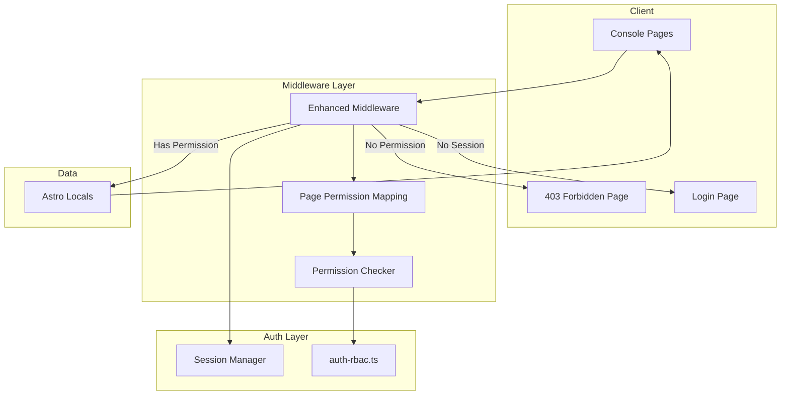

# Design Document

## Overview

Page Protection Flow là hệ thống bảo vệ trang theo role cho Game Hub Manager Console. Hệ thống này bổ sung cho RBAC Auth System đã có, tập trung vào việc centralize permission check trong middleware, hiển thị 403 Forbidden page khi user không có quyền, và inject permissions xuống client cho UI rendering.

## Architecture



## Components and Interfaces

### 1. Page Permission Mapping (`src/lib/page-permissions.ts`)

```typescript
export type PagePermissionConfig = {
  pattern: string;
  permission: Permission | null; // null = any authenticated user
};

export const PAGE_PERMISSIONS: PagePermissionConfig[] = [
  { pattern: '/console/qc-inbox', permission: 'games:review' },
  { pattern: '/console/approval', permission: 'games:approve' },
  { pattern: '/console/publish', permission: 'games:publish' },
  { pattern: '/console/my-games', permission: 'games:view' },
  { pattern: '/console/library', permission: 'games:view' },
  { pattern: '/console', permission: null }, // Dashboard - any authenticated
];

export function getRequiredPermission(pathname: string): Permission | null | undefined;
export function checkPageAccess(user: User, pathname: string): boolean;
```

### 2. Enhanced Middleware (`src/middleware.ts`)

```typescript
// Extended middleware with page-level permission check
export const onRequest = defineMiddleware(async (context, next) => {
  // 1. Check if protected route
  // 2. Verify session
  // 3. Check page-level permission
  // 4. Return 403 page if no permission
  // 5. Attach user + permissions to locals
});
```

### 3. 403 Forbidden Page (`src/pages/403.astro`)

```typescript
interface Props {
  user: User;
  requestedPath: string;
}

// Display:
// - "Bạn không có quyền truy cập trang này"
// - User's current roles
// - Button to return to Dashboard
```

### 4. Astro Locals Extension

```typescript
// src/env.d.ts
declare namespace App {
  interface Locals {
    user: User | null;
    permissions: Permission[];
  }
}
```

### 5. Client Permission Helper

```typescript
// Injected into page context
interface ClientAuth {
  user: User;
  permissions: Permission[];
  can: (permission: Permission) => boolean;
}
```

## Data Models

### Page Permission Config

```typescript
{
  pattern: string;      // Route pattern (prefix match)
  permission: string | null;  // Required permission or null for any auth
}
```

### Astro Locals

```typescript
{
  user: {
    _id: ObjectId;
    email: string;
    name: string;
    roles: Role[];
  };
  permissions: string[];  // ["games:view", "games:create", ...]
}
```

## Correctness Properties

*A property is a characteristic or behavior that should hold true across all valid executions of a system-essentially, a formal statement about what the system should do. Properties serve as the bridge between human-readable specifications and machine-verifiable correctness guarantees.*

### Property 1: Unauthorized Access Returns 403
*For any* logged-in user and any protected page, if the user lacks the required permission for that page, the response status should be 403.
**Validates: Requirements 1.1, 3.2**

### Property 2: 403 Page Shows User Role
*For any* user who receives a 403 response, the rendered page should contain information about the user's current roles.
**Validates: Requirements 1.3**

### Property 3: Permission Check Determinism
*For any* user and route, calling the permission check function multiple times with the same inputs should always return the same boolean result.
**Validates: Requirements 3.4**

### Property 4: Middleware Attaches User and Permissions
*For any* authenticated user with valid permissions accessing a protected page, the Astro locals should contain both the user object and their permissions array.
**Validates: Requirements 3.3, 4.1**

### Property 5: All User Permissions Injected
*For any* user with multiple roles, the injected permissions array should contain all permission strings from all of the user's roles (union of role permissions).
**Validates: Requirements 4.2**

### Property 6: Client Permission Helper Consistency
*For any* permission string and user, the client helper function `can(permission)` should return true if and only if the permission is in the user's permissions array.
**Validates: Requirements 4.3**

### Property 7: Unauthenticated Redirect Includes Return URL
*For any* protected page URL, when an unauthenticated user accesses it, the redirect should be to "/login" with a "redirect" query parameter equal to the original URL.
**Validates: Requirements 5.1**

### Property 8: Post-Login Redirect Honors Parameter
*For any* valid redirect URL in the login redirect parameter, after successful login, the user should be redirected to that URL.
**Validates: Requirements 5.2**

## Error Handling

### Permission Errors
- Missing permission: Return 403 with custom 403 page
- Invalid session: Redirect to /login with return URL

### Configuration Errors
- Unknown route pattern: Allow access (no permission required)
- Invalid permission string: Log warning, deny access

## Testing Strategy

### Unit Testing
- Test page permission mapping lookup
- Test permission check function with specific user/route combinations
- Test client helper function

### Property-Based Testing
Using `fast-check` library for TypeScript:

1. **Permission Check Tests**: Generate random users with various roles and routes, verify correct 403/200 responses
2. **Redirect Tests**: Generate random protected URLs, verify redirect includes correct query parameter
3. **Permission Injection Tests**: Generate users with multiple roles, verify all permissions are included

Each property-based test will:
- Run minimum 100 iterations
- Use smart generators that constrain to valid input space
- Be tagged with the correctness property it validates

### Test File Structure
```
src/
├── lib/
│   ├── page-permissions.ts
│   └── page-permissions.test.ts  # Property tests
├── middleware.ts
└── pages/
    └── 403.astro
```
