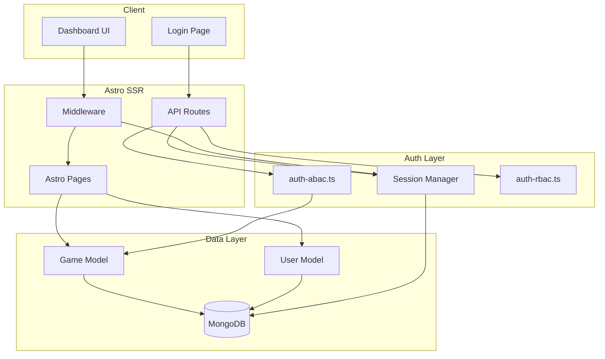

# Design Document

## Overview

Hệ thống RBAC cho Game Hub Manager triển khai phân quyền theo workflow: Dev → QC → CTO/CEO → Admin. Sử dụng MongoDB làm database, Astro SSR cho backend, và kết hợp RBAC + ABAC cho permission system linh hoạt.

## Architecture



## Components and Interfaces

### 1. MongoDB Connection (`src/lib/mongodb.ts`)

```typescript
interface MongoConnection {
  client: MongoClient;
  db: Db;
}

// Singleton pattern với connection caching
let cachedConnection: MongoConnection | null = null;

export async function getMongoClient(): Promise<MongoConnection>;
export function getDb(): Db;
```

### 2. User Model (`src/models/User.ts`)

```typescript
export type Role = "dev" | "qc" | "cto" | "ceo" | "admin";

export interface User {
  _id: ObjectId;
  email: string;
  name: string;
  roles: Role[];
  avatar?: string;
  teamIds?: string[];
  createdAt: Date;
  updatedAt: Date;
}

export interface UserRepository {
  findByEmail(email: string): Promise<User | null>;
  findById(id: string): Promise<User | null>;
  create(user: Omit<User, '_id' | 'createdAt' | 'updatedAt'>): Promise<User>;
  updateRoles(id: string, roles: Role[]): Promise<User | null>;
}
```

### 3. Game Model (`src/models/Game.ts`)

```typescript
export type GameStatus = 
  | "draft" 
  | "uploaded" 
  | "qc_passed" 
  | "qc_failed" 
  | "approved" 
  | "published" 
  | "archived";

export interface Game {
  _id: ObjectId;
  gameId: string;        // e.g., "com.iruka.math"
  title: string;
  ownerId: string;       // User._id
  teamId?: string;
  status: GameStatus;
  isDeleted: boolean;
  createdAt: Date;
  updatedAt: Date;
}

export interface GameRepository {
  findById(id: string): Promise<Game | null>;
  findByOwnerId(ownerId: string): Promise<Game[]>;
  findByStatus(status: GameStatus): Promise<Game[]>;
  findAll(): Promise<Game[]>;
  create(game: Omit<Game, '_id' | 'createdAt' | 'updatedAt'>): Promise<Game>;
  updateStatus(id: string, status: GameStatus): Promise<Game | null>;
}
```

### 4. Session Manager (`src/lib/session.ts`)

```typescript
export interface SessionPayload {
  userId: string;
  email: string;
  roles: Role[];
  exp: number;
}

export function createSession(user: User): string;
export function verifySession(token: string): SessionPayload | null;
export function getUserFromRequest(request: Request): Promise<User | null>;
export function setSessionCookie(response: Response, token: string): void;
export function clearSessionCookie(response: Response): void;
```

### 5. Permission System - ABAC (`src/auth/auth-abac.ts`)

```typescript
type PermissionCheck<T> = boolean | ((user: User, data: T) => boolean);

type GamePermissions = {
  view: PermissionCheck<Game>;
  create: PermissionCheck<Game>;
  update: PermissionCheck<Game>;
  submit: PermissionCheck<Game>;
  review: PermissionCheck<Game>;
  approve: PermissionCheck<Game>;
  publish: PermissionCheck<Game>;
};

export const ROLES: Record<Role, { games: Partial<GamePermissions> }>;

export function hasPermission(
  user: User,
  resource: "games",
  action: keyof GamePermissions,
  data?: Game
): boolean;
```

### 6. Permission System - RBAC (`src/auth/auth-rbac.ts`)

```typescript
type Permission = 
  | "games:view" | "games:create" | "games:update" 
  | "games:submit" | "games:review" | "games:approve" | "games:publish";

export const ROLE_PERMISSIONS: Record<Role, Permission[]>;

export function hasPermissionString(user: User, permission: Permission): boolean;
```

### 7. Middleware (`src/middleware.ts`)

```typescript
// Astro middleware
export const onRequest: MiddlewareHandler = async (context, next) => {
  // Check protected routes
  // Verify session
  // Attach user to locals
  // Handle redirects
};
```

## Data Models

### User Collection Schema

```javascript
{
  _id: ObjectId,
  email: { type: String, unique: true, required: true },
  name: { type: String, default: "" },
  roles: { type: [String], enum: ["dev", "qc", "cto", "ceo", "admin"], default: ["dev"] },
  avatar: { type: String, default: "" },
  teamIds: { type: [String], default: [] },
  createdAt: { type: Date, default: Date.now },
  updatedAt: { type: Date, default: Date.now }
}
```

### Game Collection Schema

```javascript
{
  _id: ObjectId,
  gameId: { type: String, unique: true, required: true },
  title: { type: String, required: true },
  ownerId: { type: String, required: true },
  teamId: { type: String },
  status: { 
    type: String, 
    enum: ["draft", "uploaded", "qc_passed", "qc_failed", "approved", "published", "archived"],
    default: "draft"
  },
  isDeleted: { type: Boolean, default: false },
  createdAt: { type: Date, default: Date.now },
  updatedAt: { type: Date, default: Date.now }
}
```


## Correctness Properties

*A property is a characteristic or behavior that should hold true across all valid executions of a system-essentially, a formal statement about what the system should do. Properties serve as the bridge between human-readable specifications and machine-verifiable correctness guarantees.*

### Property 1: MongoDB Connection Reuse
*For any* sequence of concurrent requests to the application, the system should use at most one MongoDB connection instance (singleton pattern).
**Validates: Requirements 1.2**

### Property 2: User Email Uniqueness
*For any* two users in the system, if both users exist, their email addresses must be different.
**Validates: Requirements 2.1**

### Property 3: Default Role Assignment
*For any* user created without specifying roles, the user's roles array should contain exactly ["dev"].
**Validates: Requirements 2.2**

### Property 4: Valid Role Constraint
*For any* user in the system, all roles in the roles array must be one of: "dev", "qc", "cto", "ceo", "admin".
**Validates: Requirements 2.3**

### Property 5: Game Default Status
*For any* newly created game, the initial status should be "draft".
**Validates: Requirements 3.2**

### Property 6: Valid Game Status Constraint
*For any* game in the system, the status must be one of: "draft", "uploaded", "qc_passed", "qc_failed", "approved", "published", "archived".
**Validates: Requirements 3.3**

### Property 7: Game Serialization Round Trip
*For any* valid Game object, serializing to JSON and deserializing back should produce an equivalent Game object.
**Validates: Requirements 3.5**

### Property 8: Session Creation Contains User Info
*For any* valid user, creating a session should produce a token that when verified returns the same userId, email, and roles.
**Validates: Requirements 4.1, 4.3**

### Property 9: Protected Route Redirect
*For any* request to /dashboard/* without a valid session, the response should be a redirect to /login.
**Validates: Requirements 5.1**

### Property 10: API Route Protection
*For any* request to /api/games/* without a valid session, the response status should be 401.
**Validates: Requirements 5.2**

### Property 11: Dev Permission - Own Game Only
*For any* dev user and any game, the user can only update/submit games where game.ownerId equals user.id.
**Validates: Requirements 6.1, 6.5**

### Property 12: Dev Permission - Status Constraint
*For any* dev user and their own game, update is only allowed when game.status is in ["draft", "uploaded", "qc_failed"].
**Validates: Requirements 6.1**

### Property 13: QC Permission - Review Constraint
*For any* qc user and any game, review action is only allowed when game.status equals "uploaded".
**Validates: Requirements 6.2**

### Property 14: CTO/CEO Permission - Approve Constraint
*For any* cto or ceo user and any game, approve action is only allowed when game.status equals "qc_passed".
**Validates: Requirements 6.3**

### Property 15: Admin Permission - Publish Constraint
*For any* admin user and any game, publish action is only allowed when game.status equals "approved".
**Validates: Requirements 6.4**

### Property 16: Permission Check Determinism
*For any* user, resource, action, and data, calling hasPermission multiple times with the same inputs should always return the same boolean result.
**Validates: Requirements 6.6**

### Property 17: RBAC String Permission Check
*For any* user with multiple roles, hasPermissionString returns true if at least one role includes the requested permission.
**Validates: Requirements 7.1**

### Property 18: Admin Has All Permissions
*For any* admin user and any games permission string, hasPermissionString should return true.
**Validates: Requirements 7.4**

### Property 19: Game List API - Dev Filter
*For any* dev user calling /api/games/list, all returned games should have ownerId equal to the user's id.
**Validates: Requirements 9.1**

### Property 20: Game List API - QC Filter
*For any* qc user calling /api/games/list, all returned games should have status equal to "uploaded".
**Validates: Requirements 9.2**

### Property 21: Game List API - CTO/CEO Filter
*For any* cto or ceo user calling /api/games/list, all returned games should have status equal to "qc_passed".
**Validates: Requirements 9.3**

### Property 22: Game List API - Admin No Filter
*For any* admin user calling /api/games/list, the returned games should include all games in the system.
**Validates: Requirements 9.4**

### Property 23: Seed Script Idempotence
*For any* number of times the seed script runs, the final state should have exactly 5 users with the predefined emails.
**Validates: Requirements 10.2**

## Error Handling

### Authentication Errors
- Invalid credentials: Return 401 with message "Invalid email or password"
- Expired session: Clear cookie, return 401 or redirect to /login
- Missing session: Return 401 for API, redirect for pages

### Permission Errors
- Unauthorized action: Return 403 with message "Forbidden: insufficient permissions"
- Resource not found: Return 404 with message "Resource not found"

### Database Errors
- Connection failure: Log error, return 500 with message "Database connection error"
- Validation failure: Return 400 with specific validation message

## Testing Strategy

### Unit Testing
- Test individual permission check functions with specific examples
- Test session creation and verification
- Test model validation functions

### Property-Based Testing
Using `fast-check` library for TypeScript:

1. **Permission System Tests**: Generate random users and games, verify permission rules hold
2. **Serialization Tests**: Generate random Game objects, verify round-trip consistency
3. **API Filter Tests**: Generate random game lists and users, verify correct filtering

Each property-based test will:
- Run minimum 100 iterations
- Use smart generators that constrain to valid input space
- Be tagged with the correctness property it validates

### Test File Structure
```
src/
├── auth/
│   ├── auth-abac.ts
│   ├── auth-abac.test.ts      # Property tests for ABAC
│   ├── auth-rbac.ts
│   └── auth-rbac.test.ts      # Property tests for RBAC
├── models/
│   ├── User.ts
│   ├── User.test.ts
│   ├── Game.ts
│   └── Game.test.ts           # Round-trip property test
└── lib/
    ├── session.ts
    └── session.test.ts
```
